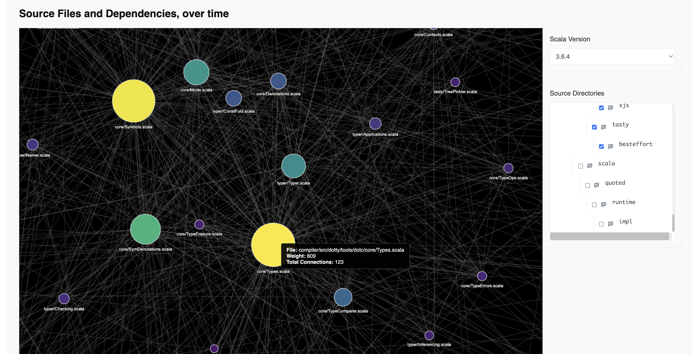
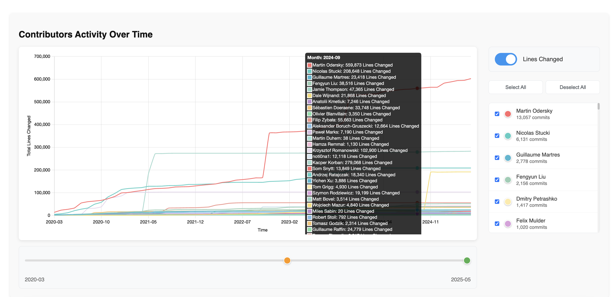
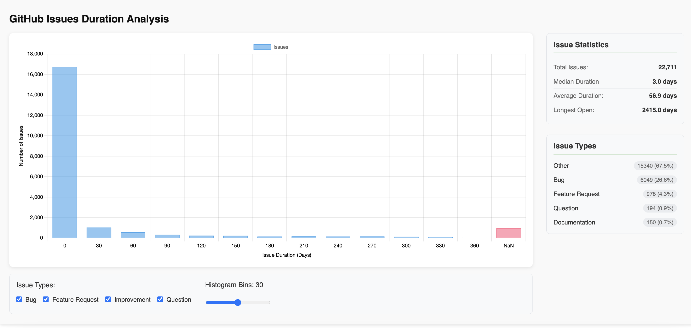
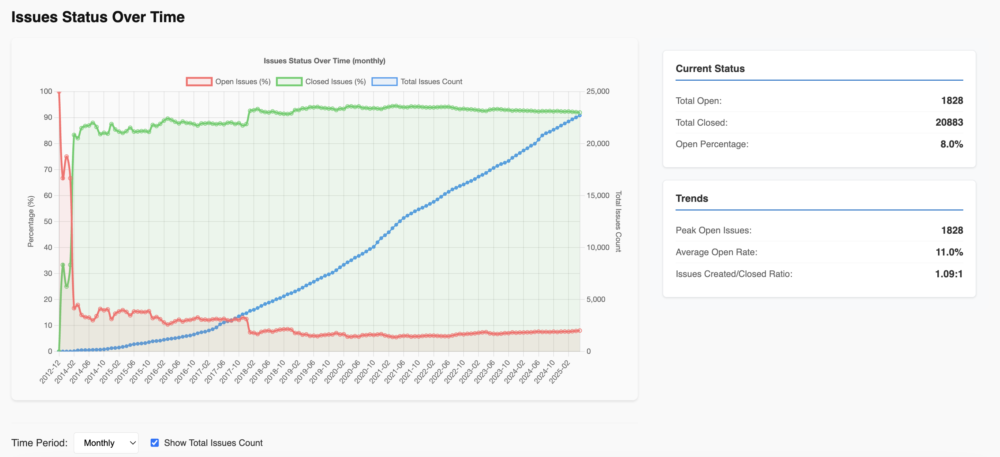

# Dotty (Scala 3) Compiler Visualization Report

**Website is live at https://com-480-data-visualization.github.io/COM-480-S25-Dotty-Visualization/**

Project of Data Visualization (COM-480 S25)

| Student's name | SCIPER |
| -------------- | ------ |
| Cao Nguyen Pham | 354716 |
| Yaoyu Zhao | 319801 |
| Yingtian Tang | 368634 |

## Overview

This project aims to visualize the code structure, development progress, and maintenance status of the Dotty (Scala 3) compiler (https://github.com/scala/scala3). Dotty is the next-generation compiler for the Scala programming language, used by a wide range of developers—from large enterprises and academic institutions to individual hobbyists.
As an open-source project hosted on GitHub, Dotty benefits from a large and diverse contributor base. While core development is led by the LAMP group and the Scala Center at EPFL, hundreds of external contributors—both individuals and industry professionals—have actively shaped the project.
With hundreds of thousands of lines of code and multiple interconnected components (such as the core compiler, language server, and documentation generator), Dotty is a large and complex system. Maintaining such a project requires continuous collaboration among developers, who must simultaneously implement new features and respond to user-reported issues in a timely manner.

Our goal is to create an interactive, navigable visualization of the project’s development and maintenance history—mapped across two key dimensions: contributors and functional modules (down to the level of individual source files). This visualization also captures the project's evolution over time and across official release milestones.

## Screeenshots







## Running the web application

It requires npm and parcel to run the web application. Once node.js is installed, you can install the dependencies and deploy using the following commands:

```bash
cd app
npm install --save-dev parcel
npm run dev
```

If everything is set up correctly, you should be able to access the web application at `http://localhost:1234`.

## Previous Milestones

See README_old.md for previous milestones.
